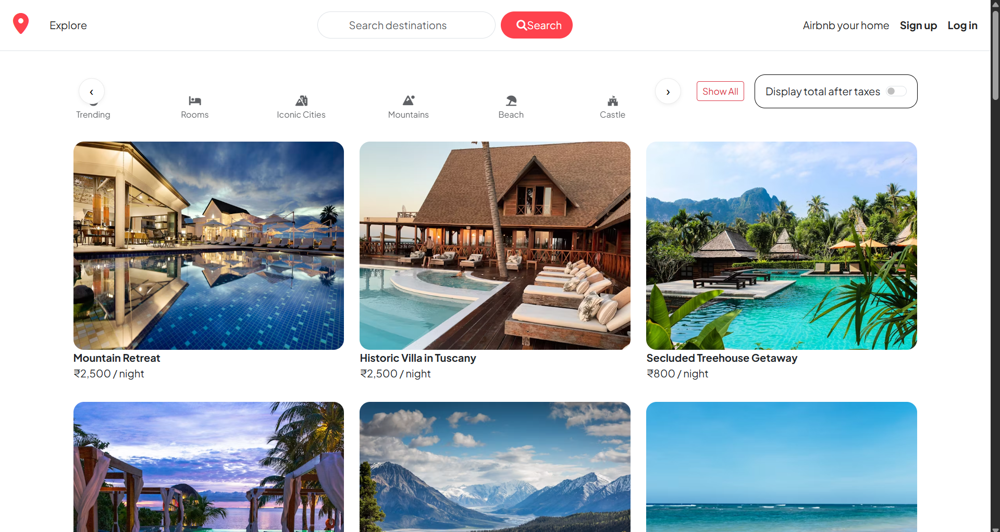

# 🏡 Tour-it

A full-stack web application that replicates the core features of **Airbnb**.  
Users can create listings, upload images, leave reviews, and manage their own properties with secure authentication and authorization.

**Live Demo:**  

---

## 🚀 Features
- 🔐 **Authentication & Authorization**
  - User registration and login system (using Passport.js)
  - Secure password handling (passport-local-mongoose)
  - Only listing owners can edit/delete their listings
  - Only review authors can edit/delete their reviews
- 🏠 **Listings**
  - Create, update, and delete listings
  - Upload multiple images with **Multer + Cloudinary**
  - Validation with **Joi**
- 💬 **Reviews & Comments**
  - Add star ratings & comments on listings
  - Edit/Delete only your own reviews

---

## 🛠️ Tech Stack
**Frontend:**  
- HTML, CSS, JavaScript, EJS, EJS-Mate  

**Backend:**  
- Node.js, Express.js  

**Database:**  
- MongoDB with Mongoose  

**Authentication & Security:**  
- Passport.js, Passport-Local, Passport-Local-Mongoose  
- Express-Session, Connect-Flash  

**Image Uploads:**  
- Multer, Multer-Storage-Cloudinary, Cloudinary  

**Validation:**  
- Joi  

---

## 📸 Screenshots  

  
  

  
  

  

